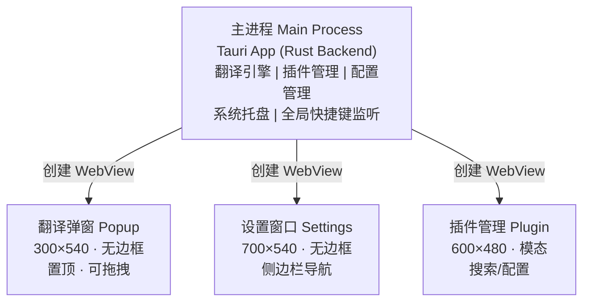
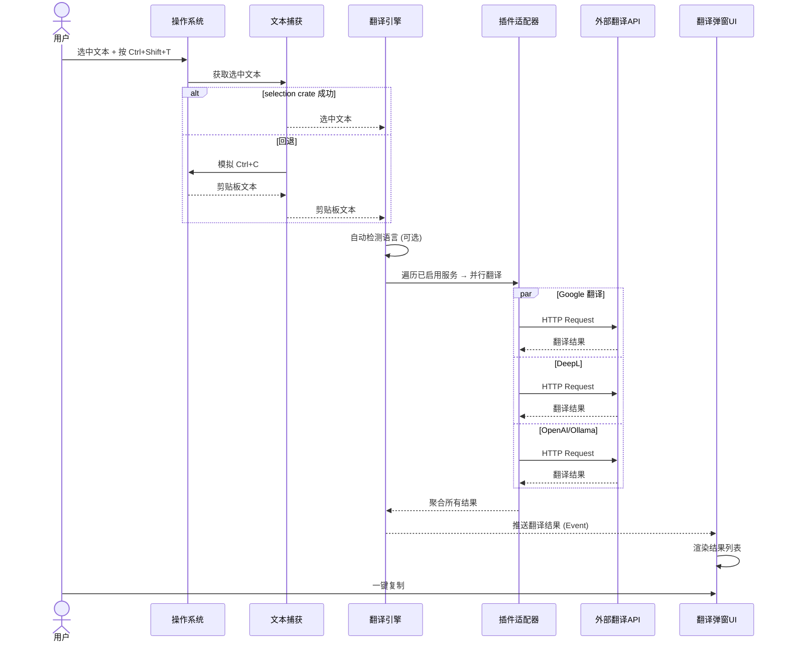
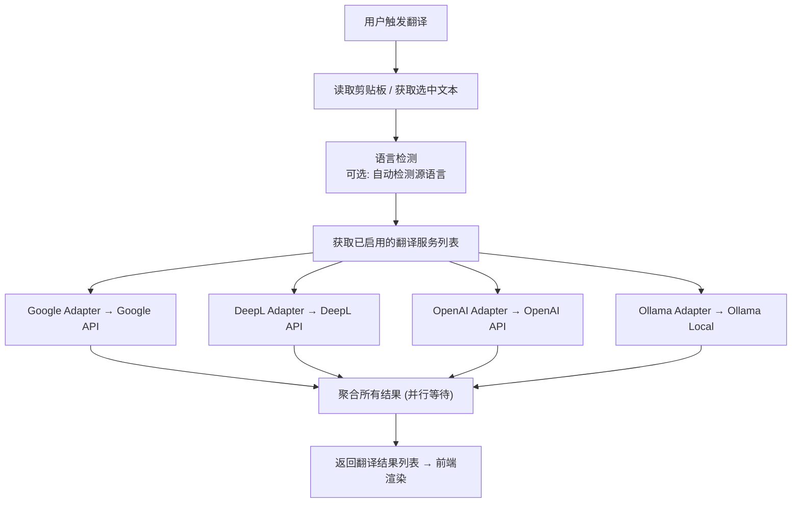
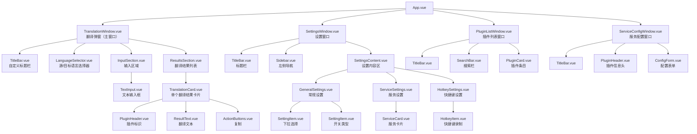

# Transight 系统架构设计

## 1. 项目概述

Transight 是一款基于 Tauri 2 + Vue 3 的跨平台划词翻译工具。用户通过划选文本 + 快捷键触发翻译弹窗，支持多翻译源并行翻译结果展示。配套设置管理窗口用于配置翻译服务、插件和快捷键。

### 核心功能

| 功能模块 | 描述 |
|---------|------|
| 划词翻译 | 选中文本 → 快捷键触发 → 弹出翻译窗口 → 多源并行翻译 |
| 翻译弹窗 | 显示原文、语言选择、多翻译源结果、一键复制 |
| 服务管理 | 管理内置/自定义翻译服务（Google、DeepL、OpenAI、Ollama 等） |
| 插件系统 | 统一插件接口，支持配置不同翻译源适配器 |
| 快捷键配置 | 自定义划词翻译、显示/隐藏窗口等快捷键 |
| 系统托盘 | 常驻系统托盘，快速访问翻译和历史记录 |

### 技术选型

| 层 | 技术 | 理由 |
|---|------|------|
| 桌面框架 | Tauri 2 | 轻量、跨平台、Rust 后端高性能 |
| 前端 | Vue 3 + TypeScript | 组件化、生态丰富、Tauri 社区支持好 |
| UI 组件库 | Naive UI | Vue 3 原生、暗色模式、Tauri 风格匹配 |
| 状态管理 | Pinia | Vue 3 官方状态管理 |
| 构建工具 | Vite | 快速 HMR、配置简洁 |
| 后端 | Rust (edition 2024) | 高性能、类型安全、与 Tauri 深度集成 |
| 文本捕获 | selection crate（自研） | 跨平台文本选择捕获 |
| 配置存储 | SQLite (rusqlite) + JSON | 结构化配置 + 灵活插件定义 |

---

## 2. 系统架构

### 2.1 整体架构图

```mermaid
graph TB
    subgraph FRONTEND["前端层 — Vue 3 + TypeScript + Pinia"]
        direction LR
        POPUP["翻译弹窗<br/>300×540 弹出窗口<br/>语言选择器 / 输入框<br/>多翻译源结果展示"]
        SETTINGS["设置窗口<br/>700×540 标准窗口<br/>侧边栏导航<br/>常规 / 服务 / 快捷键"]
        PLUGINLIST["插件列表窗口<br/>600×480 模态窗口<br/>搜索 / 浏览插件<br/>安装外部插件"]
        SERVICECFG["服务配置窗口<br/>600×480 模态窗口<br/>API 密钥 / 模型配置<br/>超时 / 语言偏好"]
        PINIA["Pinia 状态管理<br/>translation store<br/>settings store<br/>plugin / hotkey store"]
    end

    subgraph IPC["IPC 通信层 — Tauri 2 Bridge"]
        direction LR
        COMMANDS["Tauri Commands<br/>invoke translate/config<br/>Rust ↔ JS 双向调用"]
        EVENTS["Tauri Events<br/>emit/listen 事件<br/>异步通知"]
        WINMGR["窗口管理<br/>多 WebView 控制<br/>显示/隐藏/置顶<br/>系统托盘集成"]
    end

    subgraph BACKEND["后端核心层 — Rust Backend"]
        direction LR
        ENGINE["翻译编排<br/>ConfigStore 读取<br/>Registry 调度<br/>parallel translate_all()"]
        PLUGINMGR["PluginRegistry<br/>Arc&lt;dyn Translator&gt;<br/>startup 注册<br/>动态分发"]
        SERVICEMGR["ServiceManager<br/>服务 CRUD 操作<br/>启用/禁用控制<br/>config.json 持久化"]
        HOTKEYMGR["快捷键管理器<br/>全局热键注册<br/>快捷键重绑定<br/>Win/Mac/Linux"]
        CONFIGMGR["配置管理器<br/>全局配置读写<br/>导入/导出/重置<br/>默认值管理"]
    end

    subgraph TRAIT["插件接口层 — Translator Trait"]
        direction LR
        subgraph TRAD["Traditional 传统翻译"]
            GOOGLE["Google 翻译<br/>免费 Web API"]
            DEEPL["DeepL<br/>REST API"]
        end
        subgraph LLM["LLM 大模型翻译"]
            OPENAI["OpenAI 兼容<br/>OpenAI / Ollama / vLLM<br/>Prompt + JSONPath 提取"]
        end
        GENERIC["通用 HTTP<br/>自定义端点<br/>请求/响应模板"]
    end

    subgraph INFRA["基础设施层"]
        direction LR
        SELECTION["文本选择捕获<br/>selection crate<br/>剪贴板回退"]
        STORE["ConfigStore<br/>~/.config/transight/<br/>config.json"]
        REGISTRY["PluginRegistry<br/>Arc&lt;dyn Translator&gt;<br/>并行调度"]
        HTTP["HTTP 客户端<br/>reqwest 异步<br/>TLS/代理"]
    end

    subgraph EXTERNAL["外部服务层"]
        direction LR
        EXT_GOOGLE["Google Translate<br/>免费 Web API"]
        EXT_DEEPL["DeepL API<br/>api.deepl.com"]
        EXT_AI["OpenAI / Ollama<br/>api.openai.com<br/>localhost:11434"]
        EXT_CUSTOM["自定义 HTTP<br/>用户配置的<br/>翻译 API"]
        EXT_SYS["系统 API<br/>剪贴板 / A11y<br/>全局快捷键"]
    end

    %% 层间连接
    FRONTEND -->|"invoke / emit"| IPC
    IPC -->|"command handler"| BACKEND
    BACKEND -->|"调用"| TRAIT
    TRAIT -->|"依赖"| INFRA
    INFRA -->|"请求"| EXTERNAL
```



### 2.2 进程模型



### 2.3 核心翻译数据流



---

## 3. 核心模块设计

### 3.1 翻译引擎 (Translation Engine)

翻译引擎是整个系统的核心，负责协调多个翻译源并行翻译。

**对外接口：**

| 方法 | 说明 |
|------|------|
| `translate(text, source_lang, target_lang)` → `Vec<TranslationResult>` | 执行翻译 |
| `detect_language(text)` → `Language` | 自动检测语言 |
| `get_supported_languages()` → `Vec<Language>` | 获取支持的语言列表 |

**翻译流程：**



### 3.2 插件系统 (Plugin System)

采用 **"PluginRegistry + ConfigStore + Service"** 三层架构：

```
PluginRegistry (静态注册表)
    │  启动时注册所有内置适配器 → HashMap<plugin_id, Arc<dyn Translator>>
    │  提供 translate_all() 并行调度
    ▼
ConfigStore (~/.config/transight/config.json)
    │  持久化 Service 列表和全局配置
    │  Arc<RwLock<Config>> 线程安全共享
    ▼
Service (插件 + 用户配置 = 运行实例)
    │  一个 plugin_id 可创建多个 Service (如多个 Ollama 端点)
    │  启用/禁用控制
    ▼
Translator trait → 执行翻译
```

**翻译器类型分离：**

| 类型 | 特征 | 适配器 | 配置项 |
|------|------|--------|--------|
| **Traditional** | API 返回结构化翻译结果 | Google, DeepL | `api_key`, `api_url` |
| **LLM** | Prompt 引导翻译 + JSONPath 提取结果 | OpenAI 兼容 (覆盖 Ollama/vLLM/任何 Chat API) | `api_key`, `api_url`, `model`, `prompt_template`, `response_path` |

统一 `Translator` trait，通过 `#[async_trait]` 支持 `Arc<dyn Translator>` 动态分发：

```rust
/// 翻译器插件接口
#[async_trait]
pub trait Translator: Send + Sync {
    fn id(&self) -> &str;
    fn name(&self) -> &str;
    async fn translate(
        &self,
        text: &str,
        source_lang: &str,
        target_lang: &str,
        config: &PluginConfig,
    ) -> Result<TranslationResult, String>;
}

/// LLM 专用配置字段
pub struct PluginConfig {
    // 通用
    pub api_key: Option<String>,
    pub api_url: Option<String>,
    pub timeout_secs: u64,
    // LLM 专用
    pub model: Option<String>,
    pub prompt_template: Option<String>,  // {{source_lang}} {{target_lang}} {{text}}
    pub response_path: Option<String>,    // JSONPath: $.choices[0].message.content
}

/// 翻译结果
pub struct TranslationResult {
    pub source_text: String,
    pub translated_text: String,
    pub source_lang: String,
    pub target_lang: String,
    pub provider: String,       // 插件名称
    pub confidence: Option<f64>, // 置信度 (部分API支持)
    pub alternatives: Vec<String>,
    pub metadata: HashMap<String, String>,
}

/// 插件配置
pub struct PluginConfig {
    pub api_key: Option<String>,
    pub api_url: Option<String>,
    pub model: Option<String>,
    pub timeout_secs: u64,
    pub extra: HashMap<String, serde_json::Value>,
}
```

**内置插件适配器：**

| 适配器 | 说明 | 配置项 |
|--------|------|--------|
| GoogleTranslateAdapter | Google 翻译 (免费接口) | 无（或 API Key 用于 Cloud Translation） |
| DeepLAdapter | DeepL 翻译 API | API Key, API URL (free/pro) |
| OpenAICompatAdapter | OpenAI 兼容接口 | API Key, API URL, Model Name |
| OllamaAdapter | Ollama 本地大模型 | API URL (默认 localhost:11434), Model |
| GenericHttpAdapter | 通用 HTTP 翻译接口 | API URL, 请求模板, 响应解析规则 |

**插件注册机制：**

```rust
pub struct PluginRegistry {
    plugins: HashMap<String, Box<dyn Translator>>,
    configs: HashMap<String, PluginConfig>,
}

impl PluginRegistry {
    /// 注册内置插件
    pub fn register_builtin(&mut self) { ... }
    /// 注册自定义 HTTP 插件
    pub fn register_http_plugin(&mut self, definition: HttpPluginDef) { ... }
    /// 获取所有已注册插件
    pub fn list_plugins(&self) -> Vec<PluginInfo> { ... }
    /// 启用/禁用插件
    pub fn set_enabled(&mut self, plugin_id: &str, enabled: bool) { ... }
}
```

### 3.3 服务管理器 (Service Manager)

服务是插件的运行时实例，包含已配置的插件及其状态。

**对外接口：**

| 方法 | 说明 |
|------|------|
| `create_service(plugin_id, config)` → `ServiceId` | 创建服务 |
| `update_service(service_id, config)` | 更新服务配置 |
| `delete_service(service_id)` | 删除服务 |
| `list_services()` → `Vec<Service>` | 列出所有服务 |
| `enable_service(service_id)` | 启用服务 |
| `disable_service(service_id)` | 禁用服务 |
| `test_service(service_id)` → `Result<bool>` | 测试服务连接 |

**数据模型：**

```typescript
interface Service {
  id: string;
  name: string;
  pluginId: string;        // 关联的插件类型
  pluginName: string;      // 插件名称
  enabled: boolean;
  config: {
    apiKey?: string;
    apiUrl?: string;
    model?: string;
    timeoutSecs: number;
    sourceLang?: string;
    targetLang?: string;
    extra: Record<string, any>;
  };
  createdAt: string;
  updatedAt: string;
}
```

### 3.4 配置管理器 (Config Manager)

统一管理应用全局配置、快捷键和用户偏好。

**对外接口：**

| 方法 | 说明 |
|------|------|
| `get_global_config()` → `GlobalConfig` | 获取全局配置 |
| `update_global_config(config)` | 更新全局配置 |
| `get_hotkey_config()` → `HotkeyConfig` | 获取快捷键配置 |
| `update_hotkey(hotkey_id, binding)` | 更新快捷键绑定 |
| `reset_to_defaults()` | 重置为默认值 |
| `export_config()` / `import_config(path)` | 导出/导入配置 |
```

**配置结构：**

```typescript
interface GlobalConfig {
  // 通用设置
  general: {
    defaultSourceLang: string;    // 默认源语言
    defaultTargetLang: string;    // 默认目标语言
    autoDetectLang: boolean;      // 自动检测语言
    autoCopyResult: boolean;      // 翻译后自动复制
    autoShowOnStartup: boolean;   // 开机自启
    stayOnTop: boolean;           // 翻译窗口置顶
    pinWindow: boolean;           // 固定翻译窗口
  };

  // 快捷键设置
  hotkeys: {
    translateSelected: string;    // 翻译选中文本 (默认 Ctrl+Shift+T)
    showHideWindow: string;       // 显示/隐藏翻译窗口
    swapLanguages: string;        // 交换源/目标语言
    copyResult: string;           // 复制翻译结果
    closeWindow: string;          // 关闭弹窗
  };

  // 服务列表
  services: Service[];
}
```

### 3.5 快捷键管理器 (Shortcut Manager)

**对外接口：**

| 方法 | 说明 |
|------|------|
| `register_global_shortcuts()` | 注册所有全局快捷键 |
| `update_shortcut(id, accelerator)` | 更新单个快捷键 |
| `unregister_all()` | 注销所有快捷键 |
| `get_registered_shortcuts()` → `Vec<ShortcutInfo>` | 获取已注册快捷键列表 |

Tauri 2 提供内置的全局快捷键支持，使用 `tauri-plugin-global-shortcut`。

---

## 4. 窗口架构

### 4.1 多窗口设计

| 窗口 | 类型 | 尺寸 | 装饰 | 特性 |
|------|------|------|------|------|
| 翻译弹窗 | 无边框弹出窗 | 300×540 | 自定义标题栏 | 置顶、可拖拽、阴影 |
| 设置窗口 | 标准窗口 | 700×540 | 自定义标题栏 | 导航侧边栏、表单 |
| 插件列表 | 模态窗口 | 600×480 | 自定义标题栏 | 搜索、列表 |
| 服务配置 | 模态窗口 | 600×480 | 自定义标题栏 | 表单、验证 |

### 4.2 Tauri 窗口配置

```json
// tauri.conf.json (窗口部分)
{
  "app": {
    "windows": [
      {
        "label": "main",
        "title": "Transight",
        "width": 300,
        "height": 540,
        "decorations": false,
        "alwaysOnTop": true,
        "visible": false,
        "skipTaskbar": true
      },
      {
        "label": "settings",
        "title": "Transight - 设置",
        "width": 700,
        "height": 540,
        "decorations": false,
        "visible": false
      }
    ]
  }
}
```

---

## 5. 数据存储

### 5.1 SQLite 数据库设计

```sql
-- 服务配置表
CREATE TABLE services (
    id          TEXT PRIMARY KEY,
    plugin_id   TEXT NOT NULL,
    name        TEXT NOT NULL,
    enabled     INTEGER NOT NULL DEFAULT 1,
    config      TEXT NOT NULL,  -- JSON
    created_at  TEXT NOT NULL,
    updated_at  TEXT NOT NULL
);

-- 全局配置表
CREATE TABLE config (
    key   TEXT PRIMARY KEY,
    value TEXT NOT NULL  -- JSON
);

-- 翻译历史表
CREATE TABLE translation_history (
    id          INTEGER PRIMARY KEY AUTOINCREMENT,
    source_text TEXT NOT NULL,
    result_text TEXT NOT NULL,
    source_lang TEXT,
    target_lang TEXT,
    provider    TEXT NOT NULL,
    created_at  TEXT NOT NULL
);

-- 快捷键表
CREATE TABLE shortcuts (
    id      TEXT PRIMARY KEY,
    binding TEXT NOT NULL
);
```

### 5.2 文件结构

```
~/.config/transight/
  transight.db          # SQLite 数据库
  plugins/              # 自定义插件定义
    my-plugin.json      # 自定义HTTP插件配置
  logs/                 # 日志文件
```

---

## 6. IPC 通信设计

### 6.1 Tauri Commands

```rust
// ===== 翻译相关 =====
#[tauri::command]
async fn translate(text: String, source_lang: String, target_lang: String)
    -> Result<Vec<TranslationResultDto>, String>;

#[tauri::command]
async fn detect_language(text: String) -> Result<String, String>;

#[tauri::command]
async fn get_supported_languages() -> Vec<LanguageDto>;

// ===== 服务管理 =====
#[tauri::command]
async fn list_services() -> Vec<ServiceDto>;

#[tauri::command]
async fn create_service(service: CreateServiceDto) -> Result<ServiceDto, String>;

#[tauri::command]
async fn update_service(id: String, service: UpdateServiceDto) -> Result<ServiceDto, String>;

#[tauri::command]
async fn delete_service(id: String) -> Result<(), String>;

#[tauri::command]
async fn test_service(id: String) -> Result<bool, String>;

// ===== 插件管理 =====
#[tauri::command]
async fn list_plugins() -> Vec<PluginDto>;

#[tauri::command]
async fn get_plugin(plugin_id: String) -> Result<PluginDto, String>;

#[tauri::command]
async fn register_http_plugin(definition: HttpPluginDef) -> Result<PluginDto, String>;

#[tauri::command]
async fn remove_http_plugin(plugin_id: String) -> Result<(), String>;

// ===== 配置管理 =====
#[tauri::command]
async fn get_config() -> GlobalConfigDto;

#[tauri::command]
async fn update_config(config: GlobalConfigDto) -> Result<(), String>;

#[tauri::command]
async fn reset_config() -> GlobalConfigDto;

// ===== 快捷键管理 =====
#[tauri::command]
async fn get_shortcuts() -> Vec<ShortcutDto>;

#[tauri::command]
async fn update_shortcut(id: String, binding: String) -> Result<(), String>;

// ===== 窗口管理 =====
#[tauri::command]
async fn show_translation_window() -> Result<(), String>;

#[tauri::command]
async fn hide_translation_window() -> Result<(), String>;

#[tauri::command]
async fn open_settings_window() -> Result<(), String>;

// ===== 剪贴板 =====
#[tauri::command]
async fn get_selected_text() -> Result<String, String>;

#[tauri::command]
async fn copy_to_clipboard(text: String) -> Result<(), String>;
```

### 6.2 Tauri Events

```rust
// 前端 → 后端
app.emit("translate-request", { text: "..." });

// 后端 → 前端
window.emit("translation-complete", TranslationResultDto);
window.emit("translation-error", { provider: "...", error: "..." });
window.emit("hotkey-triggered", { action: "translate_selected" });
```

---

## 7. 前端架构

### 7.1 Vue 组件树



### 7.2 状态管理 (Pinia)

```typescript
// stores/translation.ts
export const useTranslationStore = defineStore('translation', {
  state: () => ({
    sourceText: '',
    sourceLang: 'auto',
    targetLang: 'zh',
    results: [] as TranslationResult[],
    isLoading: false,
  }),
  actions: {
    async translate(text: string) { ... },
    async detectLanguage(text: string) { ... },
    setSourceLang(lang: string) { ... },
    setTargetLang(lang: string) { ... },
    swapLanguages() { ... },
  }
});

// stores/settings.ts
export const useSettingsStore = defineStore('settings', {
  state: () => ({
    activeTab: 'general',
    services: [] as Service[],
    plugins: [] as Plugin[],
    shortcuts: [] as Shortcut[],
    config: {} as GlobalConfig,
  }),
  actions: {
    async loadConfig() { ... },
    async saveConfig() { ... },
    async addService(service: CreateServiceDto) { ... },
    async removeService(id: string) { ... },
    async updateShortcut(id: string, binding: string) { ... },
  }
});
```

### 7.3 路由设计

无需 Vue Router —— 使用 Tauri 多窗口，每个窗口对应一个入口组件。

---

## 8. 安全设计

### 8.1 API 密钥管理

- API Key 使用系统级安全存储（Tauri `keyring` 插件或平台 keychain）
- 内存中不长时间驻留明文密钥
- 日志中自动脱敏

### 8.2 CSP 策略

```json
{
  "csp": "default-src 'self'; connect-src 'self' https://*.googleapis.com https://api.deepl.com https://api.openai.com http://localhost:*"
}
```

### 8.3 权限最小化

Tauri 2 使用 capability-based 权限系统：

```json
{
  "identifier": "default",
  "windows": ["main", "settings"],
  "permissions": [
    "core:default",
    "clipboard-manager:allow-read",
    "clipboard-manager:allow-write",
    "global-shortcut:allow-register",
    "global-shortcut:allow-unregister",
    "window:allow-show",
    "window:allow-hide",
    "window:allow-close"
  ]
}
```

---

## 9. 开发计划

### 第一阶段：基础框架 (MVP) ✅

- [x] Tauri 2 + Vue 3 项目初始化
- [x] 翻译弹窗窗口创建（自定义边框、拖动、阴影）
- [x] 文本选择捕获集成（X11/Wayland/Accessibility/UI Automation + 剪贴板回退）
- [x] 基础翻译引擎（Google Translate 免费接口）
- [x] 全局快捷键注册（Ctrl+Alt+Q / Escape）
- [x] 系统托盘

### 第二阶段：核心功能 ✅

- [x] 多翻译源并行翻译（tokio::spawn 逐源 emit translation-result 事件）
- [x] 内置适配器：Google Translate、DeepL、OpenAI Compat（覆盖 Ollama/vLLM）
- [x] 翻译结果展示（多卡片，每源独立状态，折叠展开）
- [x] 语言自动检测（各适配器内部处理）
- [x] 一键复制 + Markdown 渲染切换

### 第三阶段：管理功能 ✅

- [x] 设置窗口（常规/服务/快捷键三个标签页）
- [x] 服务管理 CRUD（添加/编辑/删除/启用禁用，插件动态配置表单）
- [x] PluginRegistry + ConfigStore 插件配置架构
- [x] 快捷键录制编辑（window.addEventListener 全局监听）
- [x] 语言下拉菜单（15 种语言）

### 第四阶段：进阶功能（部分完成）

- [ ] 翻译历史记录
- [ ] 离线翻译支持（本地词典）
- [ ] OCR 识图翻译（ImageTranslator trait → 截图 OCR → 自动翻译）
- [x] 导入/导出配置
- [x] 暗色模式（CSS 变量 + 跨窗口同步）
- [ ] 国际化（i18n）

---

## 10. 项目目录结构

```
Transight/
  src-tauri/                       # Rust 后端 (edition 2024)
    src/
      main.rs                      # 入口
      lib.rs                       # 窗口/托盘/快捷键/插件注册
      commands/
        mod.rs
        translate.rs               # 翻译 + 插件/服务/配置管理命令
        selection.rs               # 文本选择命令
        window.rs                  # 窗口/pin/主题广播命令
      engine/
        mod.rs
        translator.rs              # Translator trait + PluginConfig
        registry.rs                # PluginRegistry (Arc<dyn Translator>)
        google.rs                  # Google Translate 适配器 (传统)
        deepl.rs                   # DeepL 适配器 (传统)
        openai.rs                  # LLM 适配器 (Prompt + JSONPath)
      config/
        mod.rs
        store.rs                   # ConfigStore (JSON 文件持久化)
      services/
        mod.rs
        manager.rs                 # Service CRUD
      selection/
        mod.rs                     # 跨平台文本选择 (X11/Wayland/Accessibility/UI Automation)
        linux.rs
        macos.rs
        windows.rs
    Cargo.toml
    tauri.conf.json
    capabilities/
      default.json
    icons/
  src/                             # Vue 3 + TS 前端
    main.ts                        # 入口 (Pinia + Router)
    App.vue                        # 根组件 (暗色模式 + 事件监听)
    router.ts                      # / → 翻译弹窗, /#/settings → 设置
    windows/
      TranslationWindow.vue        # 翻译弹窗 (语言选择/输入/结果列表/Go按钮)
      SettingsWindow.vue           # 设置窗口 (常规/服务/快捷键 + 导入导出)
    components/
      TitleBar.vue                 # 自定义标题栏 (拖动/固定/设置/关闭)
      TranslationCard.vue          # 翻译结果卡片 (折叠/Markdown/复制)
      ServiceManager.vue           # 服务管理面板 (CRUD + 动态配置表单)
    stores/
      translation.ts               # Pinia 翻译状态 (事件驱动)
    types/
      index.ts                     # TypeScript 类型定义
    utils/
      tauri.ts                     # Tauri invoke 封装
  selection/                       # 自研 selection crate 骨架
    linux.rs / macos.rs / windows.rs
    Cargo.toml
  docs/
    architecture.md                # 系统架构设计
    system-design.md               # 系统设计文档
  Transight.pen                    # Pencil UI 设计文件
  package.json
  vite.config.ts
```
