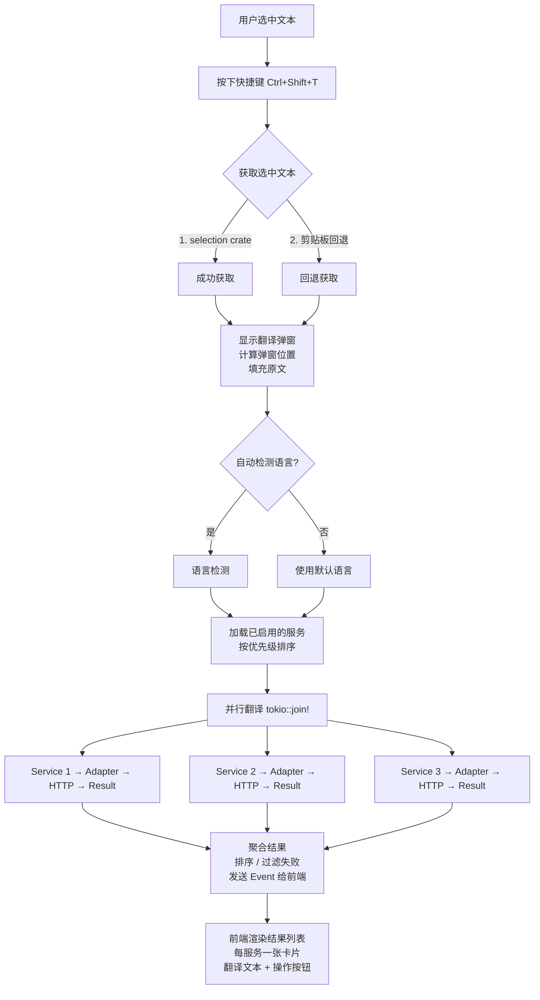
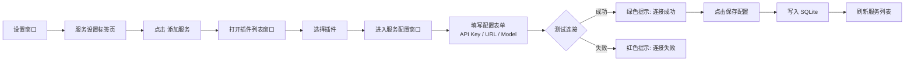
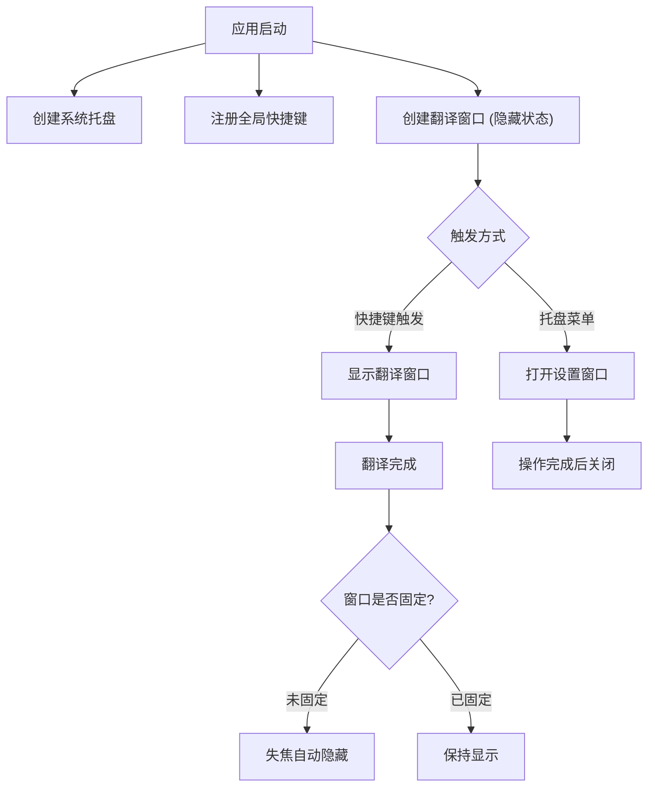
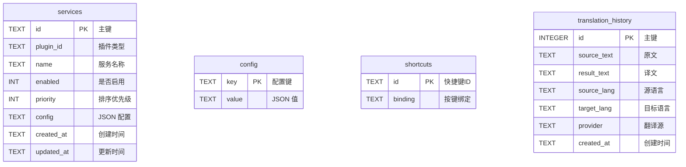
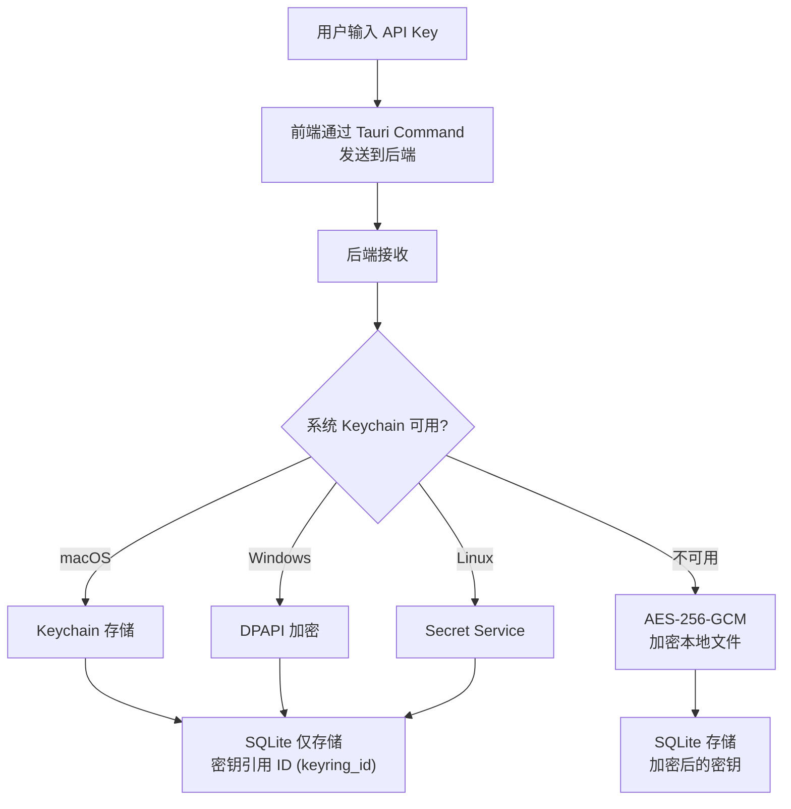

# Transight 系统设计文档

## 1. 项目背景与目标

### 1.1 项目概述

Transight 是一款跨平台划词翻译桌面工具，核心使用场景：用户在任意应用中选中文本 → 按下快捷键 → 弹出翻译窗口 → 多翻译源并行返回结果。

### 1.2 设计目标

| 目标 | 说明 |
|------|------|
| 轻量快速 | Tauri 2 打包体积 < 10MB，翻译弹窗 < 500ms 展示 |
| 跨平台 | 支持 Windows / macOS / Linux |
| 可扩展 | 插件化翻译源，支持添加自定义 HTTP 翻译接口 |
| 安全可靠 | API Key 加密存储，CSP 通信限制 |
| 体验优良 | 自定义窗口装饰、平滑动画、系统托盘常驻 |

---

## 2. 需求分析

### 2.1 功能需求

#### FR-01: 划词翻译
- **FR-01.1** 用户选中文本后，按下全局快捷键触发翻译
- **FR-01.2** 文本获取策略：优先使用 `selection` crate 直接获取选中文本，失败时回退到剪贴板方式
- **FR-01.3** 翻译弹窗在鼠标/光标附近弹出，置顶显示
- **FR-01.4** 支持手动输入/编辑待翻译文本

#### FR-02: 翻译功能
- **FR-02.1** 支持自动检测源语言
- **FR-02.2** 支持手动选择源语言和目标语言
- **FR-02.3** 支持多翻译源并行翻译，同时展示多个结果
- **FR-02.4** 支持交换源/目标语言
- **FR-02.5** 支持一键复制翻译结果到剪贴板
- **FR-02.6** 支持 TTS 语音朗读翻译结果（可选）

#### FR-03: 翻译弹窗
- **FR-03.1** 无边框窗口，自定义标题栏（标题、固定、设置、关闭）
- **FR-03.2** 窗口置顶显示，可拖拽移动
- **FR-03.3** 固定窗口功能（pin），固定后保持显示
- **FR-03.4** 窗口大小 300×540px，带圆角和阴影

#### FR-04: 插件系统
- **FR-04.1** 内置翻译源适配器：Google Translate、DeepL、OpenAI 兼容接口、Ollama
- **FR-04.2** 通用 HTTP 适配器：用户可配置任意外部翻译 API
- **FR-04.3** 本地词典适配器：支持离线词库
- **FR-04.4** 插件通过统一的 `Translator` Trait 接口实现
- **FR-04.5** 支持插件启用/禁用

#### FR-05: 服务管理
- **FR-05.1** 服务 = 插件类型 + 具体配置（API Key、URL、模型等）
- **FR-05.2** 支持创建、编辑、删除、启用/禁用服务
- **FR-05.3** 支持测试服务连接（发送测试翻译请求）
- **FR-05.4** 一个插件类型可创建多个服务实例（如多个 OpenAI 兼容端点）

#### FR-06: 设置管理
- **FR-06.1** 常规设置：默认源/目标语言、自动语言检测、自动复制、开机自启
- **FR-06.2** 翻译设置：翻译源排序、结果数量限制
- **FR-06.3** 服务设置：服务列表管理、添加/编辑服务
- **FR-06.4** 快捷键设置：翻译触发、窗口显隐、语言交换、复制结果、关闭窗口

#### FR-07: 系统集成
- **FR-07.1** 系统托盘常驻，显示图标和快捷菜单
- **FR-07.2** 开机自动启动（可选）
- **FR-07.3** 全局快捷键在任何应用中可用

### 2.2 非功能需求

| 需求 | 说明 |
|------|------|
| 性能 | 翻译弹窗从触发到显示 < 300ms |
| 可靠性 | 单个翻译源失败不影响其他源 |
| 安全性 | API Key 加密存储（系统 Keychain / 加密 SQLite） |
| 可维护性 | 插件 Trait 接口稳定，新适配器 < 200 行代码 |
| 兼容性 | Windows 10+ / macOS 12+ / Linux (X11/Wayland) |

---

## 3. 插件系统设计

### 3.1 设计理念

Transight 的插件系统采用 **"适配器模式 + Trait 接口"** 架构：

- **插件类型 (Plugin)** = 翻译源的抽象定义（如 "DeepL"、"Google Translate"）
- **服务 (Service)** = 插件类型 + 用户具体配置 = 运行时可用的翻译源实例
- 一个插件类型可以创建多个服务（如连接不同的 OpenAI 兼容端点）

### 3.2 插件定义格式

内置插件在 Rust 代码中实现 `Translator` Trait。自定义 HTTP 插件通过 JSON 配置定义：

```json
{
  "id": "custom-baidu-translate",
  "name": "百度翻译",
  "version": "1.0.0",
  "description": "百度翻译 API 接入",
  "author": "user",
  "adapter_type": "generic_http",
  "config_schema": {
    "api_key": {
      "type": "string",
      "label": "API Key",
      "required": true,
      "secret": true
    },
    "api_url": {
      "type": "string",
      "label": "API 地址",
      "default": "https://fanyi-api.baidu.com/api/trans/vip/translate"
    },
    "model": {
      "type": "string",
      "label": "模型",
      "optional": true
    }
  },
  "request_template": {
    "method": "POST",
    "headers": {
      "Content-Type": "application/json"
    },
    "body_template": {
      "q": "{{text}}",
      "from": "{{source_lang}}",
      "to": "{{target_lang}}",
      "appid": "{{config.api_key}}"
    }
  },
  "response_mapping": {
    "translated_text": "$.trans_result[0].dst",
    "source_lang": "$.from",
    "target_lang": "$.to"
  }
}
```

### 3.3 数据模型

```typescript
// 插件定义（描述一个翻译源类型）
interface PluginDefinition {
  id: string;              // 唯一标识
  name: string;            // 显示名称
  version: string;         // 版本
  description: string;     // 描述
  author: string;          // 作者
  adapterType: 'builtin' | 'generic_http';
  icon?: string;           // 图标 URL
  configSchema: ConfigField[];  // 配置项定义
}

// 配置字段定义
interface ConfigField {
  key: string;
  type: 'string' | 'number' | 'boolean' | 'select';
  label: string;
  required: boolean;
  secret?: boolean;        // 是否敏感（API Key）
  default?: any;
  options?: { label: string; value: string }[];  // select 类型的选项
}

// 服务（插件实例）
interface Service {
  id: string;
  pluginId: string;        // 关联的插件
  name: string;            // 用户自定义名称
  enabled: boolean;
  config: Record<string, any>;  // 具体配置值
  priority: number;        // 排序优先级
  createdAt: string;
  updatedAt: string;
}
```

---

## 4. 核心流程

### 4.1 翻译触发流程



### 4.2 服务配置流程


---

## 5. 窗口管理

### 5.1 窗口生命周期



### 5.2 窗口配置（Tauri 2）

```rust
// 翻译弹窗
WebviewWindowBuilder::new(app, "translate", WebviewUrl::App("/translate".into()))
    .inner_size(300.0, 540.0)
    .decorations(false)
    .always_on_top(true)
    .visible(false)
    .skip_taskbar(true)
    .build()?;

// 设置窗口
WebviewWindowBuilder::new(app, "settings", WebviewUrl::App("/settings".into()))
    .inner_size(700.0, 540.0)
    .decorations(false)
    .always_on_top(false)
    .visible(false)
    .center()
    .build()?;
```

---

## 6. 数据库设计

### 6.1 ER 图



### 6.2 迁移脚本

```sql
-- V1: 初始版本
CREATE TABLE IF NOT EXISTS services (
    id         TEXT PRIMARY KEY,
    plugin_id  TEXT NOT NULL,
    name       TEXT NOT NULL,
    enabled    INTEGER NOT NULL DEFAULT 1,
    priority   INTEGER NOT NULL DEFAULT 0,
    config     TEXT NOT NULL DEFAULT '{}',
    created_at TEXT NOT NULL DEFAULT (datetime('now')),
    updated_at TEXT NOT NULL DEFAULT (datetime('now'))
);

CREATE TABLE IF NOT EXISTS config (
    key   TEXT PRIMARY KEY,
    value TEXT NOT NULL
);

CREATE TABLE IF NOT EXISTS translation_history (
    id          INTEGER PRIMARY KEY AUTOINCREMENT,
    source_text TEXT NOT NULL,
    result_text TEXT NOT NULL,
    source_lang TEXT,
    target_lang TEXT,
    provider    TEXT NOT NULL,
    created_at  TEXT NOT NULL DEFAULT (datetime('now'))
);

CREATE TABLE IF NOT EXISTS shortcuts (
    id      TEXT PRIMARY KEY,
    binding TEXT NOT NULL
);

-- 默认快捷键
INSERT OR IGNORE INTO shortcuts (id, binding) VALUES
    ('translate_selected', 'Ctrl+Shift+T'),
    ('show_hide_window', 'Ctrl+Shift+H'),
    ('swap_languages', 'Ctrl+Shift+S'),
    ('copy_result', 'Ctrl+Shift+C'),
    ('close_window', 'Escape');
```

---

## 7. 快捷键设计

| 操作 | 默认快捷键 | 可自定义 | 说明 |
|------|-----------|---------|------|
| 翻译选中文本 | `Ctrl+Shift+T` | ✓ | 全局快捷键，触发翻译 |
| 显示/隐藏窗口 | `Ctrl+Shift+H` | ✓ | 切换翻译窗口可见性 |
| 交换语言 | `Ctrl+Shift+S` | ✓ | 交换源语言和目标语言 |
| 复制结果 | `Ctrl+Shift+C` | ✓ | 复制第一个翻译结果 |
| 关闭窗口 | `Escape` | ✓ | 关闭翻译弹窗 |

### 快捷键录制组件

前端的 HotkeyItem 组件实现快捷键录制功能：

1. 用户点击快捷键设置项
2. 组件进入 "录制" 状态
3. 用户按下组合键
4. 组件捕获并显示按键组合
5. 自动保存到后端配置

---

## 8. 安全设计

### 8.1 API 密钥存储



### 8.2 Tauri 权限配置

```json
// src-tauri/capabilities/default.json
{
  "identifier": "default",
  "description": "Transight default capabilities",
  "windows": ["translate", "settings", "plugin-list", "service-config"],
  "permissions": [
    "core:default",
    "clipboard-manager:allow-read-text",
    "clipboard-manager:allow-write-text",
    "global-shortcut:allow-register",
    "global-shortcut:allow-unregister",
    "global-shortcut:allow-is-registered",
    "window:allow-show",
    "window:allow-hide",
    "window:allow-close",
    "window:allow-set-focus",
    "window:allow-set-always-on-top",
    "tray:default"
  ]
}
```

---

## 9. 外部依赖 (Crates)

```toml
# src-tauri/Cargo.toml
[package]
name = "transight"
version = "0.1.0"
edition = "2024"

[dependencies]
tauri = { version = "2", features = ["tray-icon"] }
tauri-plugin-clipboard-manager = "2"
tauri-plugin-global-shortcut = "2"
tauri-plugin-shell = "2"
tauri-plugin-dialog = "2"

# 异步运行时
tokio = { version = "1", features = ["full"] }

# HTTP 客户端
reqwest = { version = "0.12", features = ["json", "rustls-tls"] }

# 数据库
rusqlite = { version = "0.31", features = ["bundled"] }

# 序列化
serde = { version = "1", features = ["derive"] }
serde_json = "1"

# 异步 trait (edition 2024 原生支持，可作为回退)
async-trait = "0.1"

# 日志
tracing = "0.1"
tracing-subscriber = "0.3"

# 加密
aes-gcm = "0.10"
argon2 = "0.5"

# 语言检测
whatlang = "0.16"

# 文本选择跨平台捕获
selection = { git = "https://github.com/user/selection" }

# 错误处理
thiserror = "2"
anyhow = "1"

# 工具
chrono = { version = "0.4", features = ["serde"] }
uuid = { version = "1", features = ["v4"] }
```

---

## 10. 前端依赖

```json
{
  "dependencies": {
    "vue": "^3.5",
    "pinia": "^2.2",
    "naive-ui": "^2.40",
    "@tauri-apps/api": "^2",
    "@tauri-apps/plugin-clipboard-manager": "^2",
    "@tauri-apps/plugin-global-shortcut": "^2",
    "@tauri-apps/plugin-dialog": "^2",
    "typescript": "^5.6"
  },
  "devDependencies": {
    "@vitejs/plugin-vue": "^5",
    "vite": "^6",
    "vue-tsc": "^2"
  }
}
```

---

## 11. 项目里程碑

| 阶段 | 内容 | 预计产出 |
|------|------|---------|
| M1 - 基础框架 | Tauri 2 + Vue 3 初始化、窗口管理、系统托盘、全局快捷键 | 可运行的空应用 |
| M2 - 翻译核心 | Google Translate 适配器、翻译引擎、文本框、剪贴板 | 单源可翻译 |
| M3 - 多源翻译 | DeepL、OpenAI、Ollama 适配器、并行翻译、结果展示 | 多源并行翻译 |
| M4 - 管理界面 | 设置窗口、服务管理、插件列表、服务配置 | 完整管理功能 |
| M5 - 进阶功能 | 自定义HTTP插件、翻译历史、导入导出、暗色模式 | 功能完善 |
| M6 - 打磨发布 | 性能优化、国际化、安装包、文档 | 可发布版本 |
